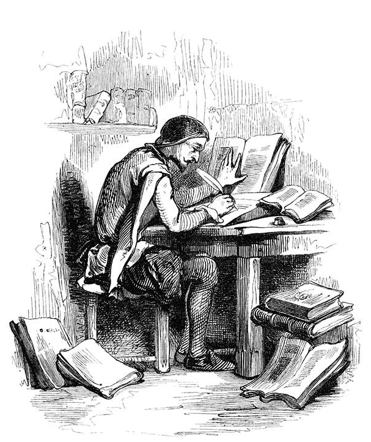

<div align="center">
    <h1><code>co-authors</code></h1>
    <p align="center"><i>A <code>git</code> wrapper to attribute coding agents via <code>Co-Authored-By</code></i></p>
    
</div>

## Installation

```bash
uv tool install https://github.com/gelt-technologies/co-authors
```

## Shell Alias Setup

Add the following alias to your shell config (`~/.bashrc`, `~/.zshrc`, etc.):

```bash
alias git="co-authors"
```

Then reload your shell:

```bash
source ~/.zshrc  # or ~/.bashrc
```

With this alias in place, all `git` commands pass through `co-authors` transparently. Only `git commit` gets special handling — everything else is forwarded to the real `git` binary unchanged.

## Usage

### Automatic attribution via `GIT_AGENT`

Set `GIT_AGENT` to the agent key for automatic `Co-Authored-By` trailer injection:

```bash
GIT_AGENT=claude git commit -m "Add feature"
# Commits with: Co-Authored-By: Claude <claude[bot]@users.noreply.github.com>
```

For persistent attribution in a session (e.g. inside a Claude Code session), export the variable:

```bash
export GIT_AGENT=claude
git commit -m "Add feature"
```

### Interactive agent selection

When `GIT_AGENT` is not set and no `-m` message is provided, `co-authors` prompts you to select an agent interactively:

```bash
git commit
# Displays a selection prompt: claude, copilot, cursor, gemini, or None
```

### Pass-through behaviour

If `-m` is provided but `GIT_AGENT` is not set, the commit proceeds without any trailer — no prompt is shown.

All non-`commit` subcommands are passed through unchanged:

```bash
git status    # forwarded directly to git
git push      # forwarded directly to git
```

## Supported Agents

| Agent key | Co-Authored-By trailer                          |
| --------- | ----------------------------------------------- |
| `claude`  | `Claude <claude[bot]@users.noreply.github.com>` |
| `cursor`  | `Cursor <cursor[bot]@users.noreply.github.com>` |

## Behaviour Matrix

| `-m` flag | `GIT_AGENT` set | Behaviour                                               |
| --------- | --------------- | ------------------------------------------------------- |
| yes       | yes             | Append trailer via `--trailer` (unless already present) |
| yes       | no              | Pass through unchanged                                  |
| no        | yes             | Append trailer via `--trailer`                          |
| no        | no              | Interactive prompt to select an agent (or none)         |

Trailers are never duplicated — if the same `Co-Authored-By` value is already present, it is not added again.
